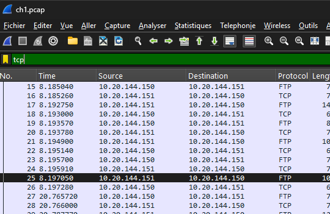
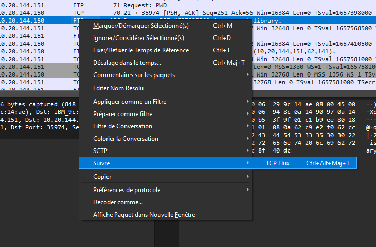
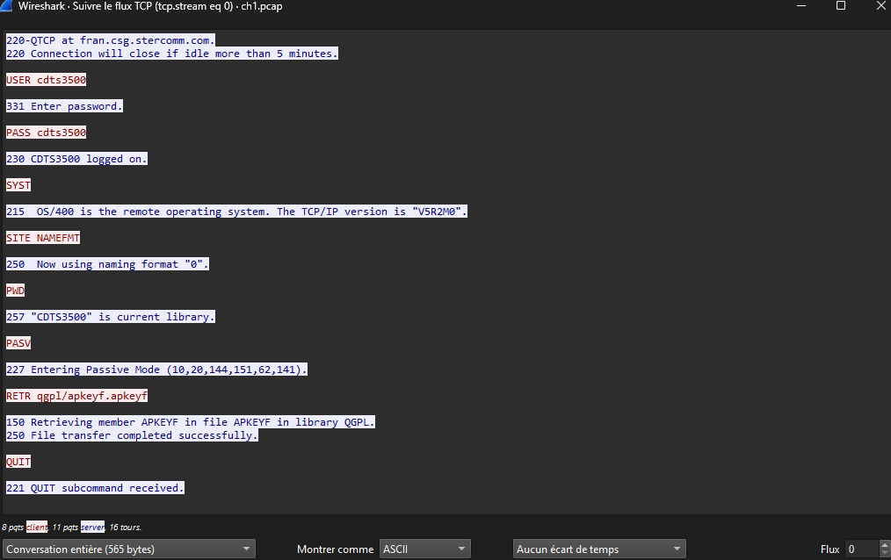

# FTP – Authentication

## Contexte
- **Catégorie** : Network  
- **Challenge** : FTP – Authentication  
- **Objectif** : Analyser un fichier de capture `.pcap` afin de retrouver les identifiants FTP (`USER` et `PASS`).  
- **Compétence démontrée** : Analyse de trafic réseau avec Wireshark, utilisation de filtres, extraction d’identifiants en clair.

---

## Étapes de la résolution

### Étape 1 : Récupération du fichier
Le fichier `ch1.pcap` est fourni par Root-Me. Une fois téléchargé, je l’ai ouvert directement dans **Wireshark** pour commencer l’analyse.

### Étape 2 : Filtrer le trafic FTP
Dans la barre de filtre Wireshark, j’ai appliqué le filtre `ftp`. Cela permet de réduire l’affichage aux seuls paquets liés au protocole FTP.

  
### Étape 3 : Suivre le flux TCP
En sélectionnant un paquet FTP contenant la commande `USER` ou `PASS`, puis en choisissant **Follow → TCP Stream**, on peut visualiser la conversation complète. Les identifiants apparaissent alors en clair.

### Étape 4 : Extraction des identifiants
Dans le flux TCP suivi, les identifiants s’affichent directement :

  - **Nom d’utilisateur** : `c******0`  
  - **Mot de passe (flag)** : `c******0`
